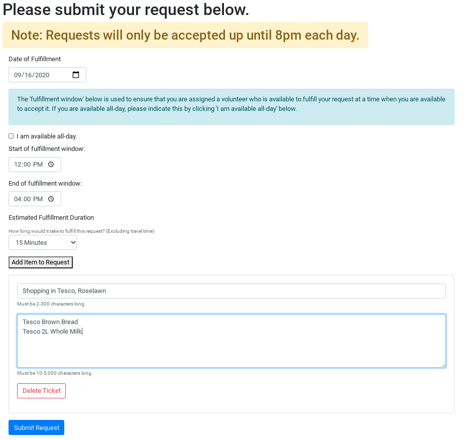
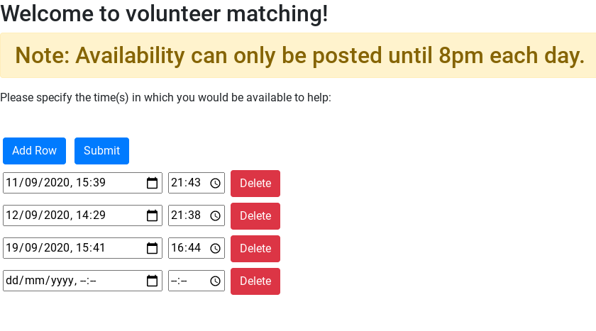
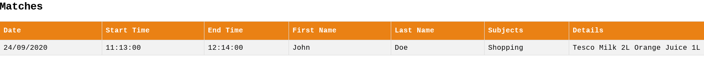

# VInet (Volunteer Isolate Network)

VINet is a Web App, designed to connect those isolating as a result of CoViD-19 with volunteers. The aim of the app is to allow isolates to request help from volunteers, for tasks the isolate cannot complete due to the restrictions on movement during the CoViD-19 pandemic. These tasks could include going to the shops for some groceries, collecting a package from the couriers and so on.

## Core Features

The core features of the VInet Web App include:

- User Authentication
- Isolate Issue Tracking
- Volunteer Availability Tracking
- Isolate / Volunteer Matching

### User Authentication

User Authentication for the VInet Web App is done via the App Engine UserService API.

This allows people to log in with their Google accounts, providing a seamless experience for users.

All ingress / egress points have user authentication, ensuring that user data is safe and secure on the app's backend.

### Isolate Issue Tracking

To allow isolates to request help from volunteers, we implemented a ticketing system, allowing isolates to send in requests that they would like fulfilled.

The ticketing system's UI is displayed below 

As can be seen from the above example, an isolate's request contains a variable number of tickets, and these tickets allow an isolate to describe what sort of help they need, such as help with grocery shopping.

### Volunteer Availability Tracking

To allow volunteers to input their availability in regards to fulfilling requests, we implemented an availability tracking system, which allows volunteers to indicate at what time and on which days they are available.

The availability tracking system's UI is displayed below 

### Isolate / Volunteer Matching

To match isolates with volunteers, VInet uses the [Hopcroft-Karp bipartite matching algorithm](https://en.wikipedia.org/wiki/Hopcroft%E2%80%93Karp_algorithm). This algorithm produces a maximum cardinality matching, which is to say, the algorithm ensures that the number of isolates helped is as large as possible.

Matching is run as a cron job each evening at 8pm. This was determined as the ideal time to run the matching algorithm, as it would allow for the matching algorithm to run to completion overnight, and for users to be notified of the matchings produced on the following morning.

Once the algorithm has run, the matches found are accessible to both volunteers and isolates in a table as below.



## Getting Started

### Prerequisites

In order to build and/or run this project, you will need:

1. [Git](https://git-scm.com/)
2. [Apache Maven](https://maven.apache.org/)

### Building Locally

The first thing you will need to do is `git clone` this repo using one of the following commands:

HTTPS:

```bash
git clone https://github.com/googleinterns/step226-2020.git
```

SSH:

```bash
git clone git@github.com:googleinterns/step226-2020.git
```

GitHub CLI:

```bash
gh repo clone googleinterns/step226-2020
```

Now that you have the project available locally you can either:

- Run the tests for this project.
- Run the project locally on a development server.
- Deploy the project to Google's App Engine.

#### Running Tests

To run the tests for this project, run the following command from the terminal:

```bash
mvn test
```

The first time you run this command, it might take a few minutes to fetch all of the project dependencies - this is normal.

#### Running the project locally on a development server

To run this project locally on a development server, run the following command from the terminal:

```bash
mvn package appengine:run
```

Once the development server has started, the project will be available at <localhost:8080>.

Note: The development server will not hot-reload files. If you wish to make and test changes, you must reload the development server.

#### Deploying the Project to App Engine

To deploy this project to App Engine, you will need to enable to [App Engine](cloud.google.com/appengine) service from the [google cloud console](console.cloud.google.com).

Once you have done so, copy the [project id](cloud.google.com/resource-manager/docs/creating-managing-projects#identifying_projects) of your google cloud console project.

Navigate into this project's root directory, and edit the `pom.xml` file. You will need to change the following entry in the `<plugins>` section:

```xml
<plugin>
  <groupId>com.google.cloud.tools</groupId>
  <artifactId>appengine-maven-plugin</artifactId>
  <version>2.2.0</version>
  <configuration>
    <deploy.projectId>YOUR_PROJECT_ID</deploy.projectId>
    <deploy.version>1</deploy.version>
  </configuration>
</plugin>
```

Under `<configuration>`, change the `<deploy.projectId>` tag to contain **your google cloud project's id**.

Once this has been configured, run the following command:

```bash
mvn package appengine:deploy
```

The project will be deployed, and will be visible under the App Engine dashboard.
